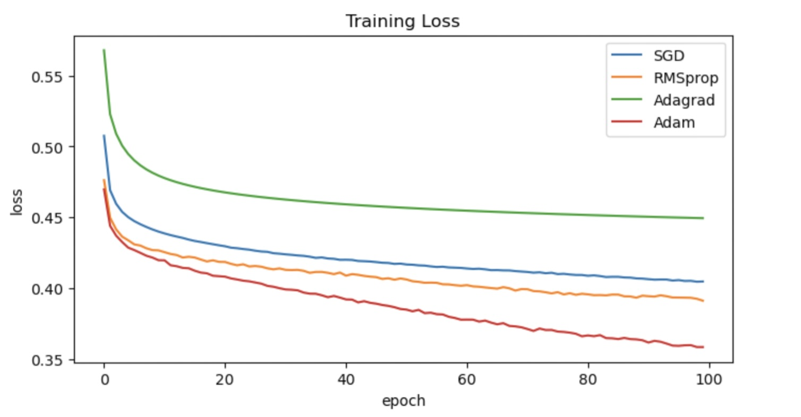
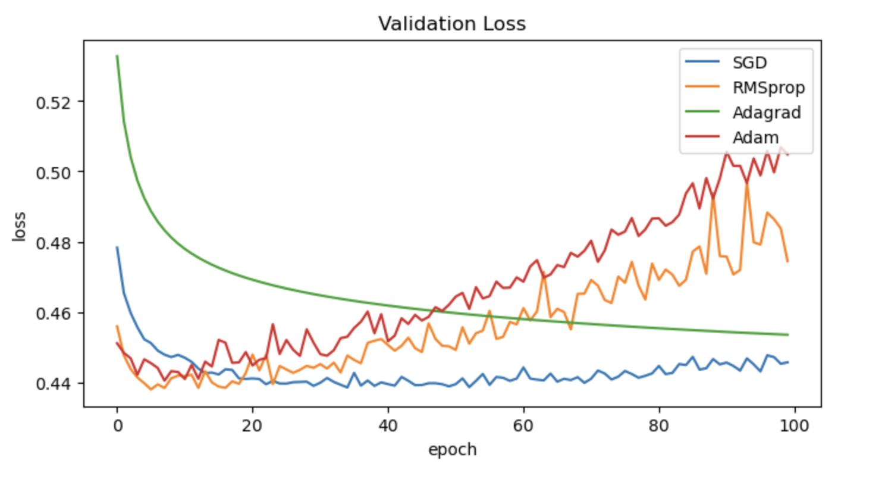

# Default Prediction Using MLP

## Overview
This project implements a Multi-Layer Perceptron (MLP) using TensorFlow to predict defaults on credit card payments. The dataset used is the "Default of Credit Card Clients" dataset, which contains financial information on clients and whether they defaulted on their payments. The objective is to build a predictive model that can assist financial institutions in assessing credit risk.

## Dataset
The dataset can be found here: https://archive.ics.uci.edu/dataset/350/default+of+credit+card+clients 

## Model Architecture
The MLP consists of the following layers:
- **Input Layer:** Takes in 23 numerical features from the dataset. 
- **Hidden Layers:** 
  - First hidden layer with 64 neurons and ReLU activation. 
  - Second hidden layer with 32 neurons and ReLU activation. 
- **Output Layer:** 
  - A single neuron with a sigmoid activation function for binary classification (default vs. no default). 

## What the Code Accomplishes
This code experiments with what is the best optimiser for the model being trained on this dataset. The resulting graphs in the experement has an interesting output. 
 
 
  We can see that in validation , with this dataset, RMSprop and Adam are overfitting the data. Usually Adam, is the best performing optimiser, however, in this case SGD has a lower loss.   

## Future Improvements
- Add more layers to the model and change the number of nodes in the hidden layers.
- Apply a different method of regularization (Dropout, Early Stopping)

